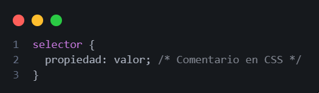
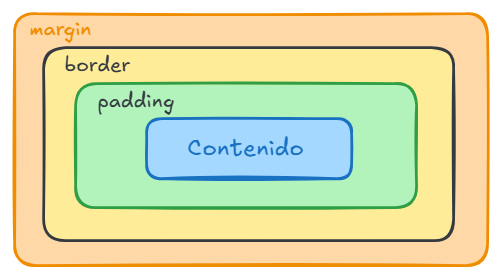

# CSS
### Cascading Style Sheets

Es un lenguaje declarativo para describir la presentación de un documento.

> **NOTA:** desde el 1996

### Estructura de un elemento para CSS



### Colores
Existen varias formas de la representación de colores, las más ocupadas son las siguientes
```
  color: #1765e5;
  color: rgb(0 250 0 / 50%);
  color:hsl(70, 60.60%, 26.90%);
  color: rgba(0, 0, 0, 0.8);
  color: oklch(0.2 0.5 0.5);
```

#### Current Color
Es el valor que se está tomando por defecto por el color que posee el elemento actual o el elemento elemento superior.

### Clases e identificadores
En CSS, se utilizan los selectores de ID y de clase para aplicar estilos a elementos HTML.

#### Clase llamada desde CSS
Es un atributo único que se le da a un solo elemento HTML en una página. Solo debe haber un elemento en la página que tenga ese ID. Los ID se definen en HTML utilizando el atributo «id», y se seleccionan en CSS utilizando el selector «#».
```
.class_name {
  propiedad: valor
}
```

#### Identificador llamado desde CSS
Es un atributo que se le da a uno o más elementos HTML en una página. Se pueden aplicar varias clases a un solo elemento, y varias clases a varios elementos. Las clases se definen en HTML utilizando el atributo «class», y se seleccionan en CSS utilizando el selector «.»
```
#id_name {
  propiedad: valor
}
```

### Herencia de estilos
Los estilos aplicados a un elemento padre se transmiten automáticamente a sus elementos hijos. Solo algunas propiedades como ```color```, ```font-family``` o ```line-height``` se heredan por defecto. Para forzar la herencia en otras propiedades, se puede usar ```inherit```.

### Estados en CSS
Se refiere a cómo la apariencia de un elemento en respuesta a una interacción del usuario o una condición. Esto se maneja mediante pseudo-clases.

- **:hover** => cuando el cursor se encuentra sobre el elemento.
- **:active** => cuando el elemento está siendo presionado.
- **:focus** => cuando el elemento enfocado (como un input).
- **:visited** => cuando un enlace ha sido visitado.
- **:checked** => cuando un checkbox o radio está seleccionado.
- **:first-child** => cuando el es el primer elemento de una lista o el primer hijo.
- **:last-child** => cuando el es el último elemento de una lista o el último hijo.

### Selectores combinados
Permiten seleccionar elementos en relación con otros. Son útiles para aplicar estilos con más precisión.

- **1.Selector descendente( )**: Selecciona elementos dentro de otro.
- **2.Selector hijo directo(>)**: Selecciona solo los elementos que son hijos directos.
- **3.Selector de hermano adyacente(+)**: Selecciona un elemento que esté inmediatamente después de otro.
- **4.Selector de hermanos generales(~)**: Selecciona todos los elementos que vienen después de un elemento.

### Cascada
Se refiere al mecanismo que utiliza el navegador para decidir qué estilo aplicar cuando hay múltiples  reglas que podrían aplicarse al mismo elemento.

Cuando hay varias reglas de CSS que afectan a un mismo elemento, el navegador decide cuál aplicar según una jerarquía de prioridad que se basa en 3 factores principales.
- *1. Especifidad*: Cuanto más específico sea un selector, más prioridad tiene
- *2. Orden de aparición*: Si 2 reglas tienen la misma especifidad, gana la que aparece más abajo, es decir, la que se escribió más tarde en la hoja de estilos o el HTML.
- *3. Origen del estilo*: Hay tres orígenes principales de estilos:
  - Usuario (estilos personalizados del usuario)
  - Autor (el CSS que usa el programador)
  - User agent (los estilos por defecto del navegador)

Además, los estilos pueden tener diferentes niveles de importancia:
> **NOTA:** Los estilos con  ```!important``` tienen prioridad máxima, incluso sobre reglas más específicas (aunque esto puede complicar el mantenimiento del código).

### Unidades
Existen varias formas de representación de unidades, las más ocupadas son las siguientes:

 - **Absolutas**
```
  width: 150px;
  width: 5cm;
  height: 50mm;
  width: 1in;
```
- **Relativas**
```
  width: 75%;
  width: 1.5em;
  height: 1.5rem;
  width: 50vw;
  height: 50vh;
```
#### Diferencias entre ```span``` y ```div```
**1.** Los  ```span``` funcionan en línea (inline) por defecto, mientras que los  ```div``` funcionan en bloque (block).

**2.** Los  ```div``` ocupan todo el ancho disponible, mientras que los  ```span``` tienen la altura y anchura del contenido.

**3.** Los  ```span``` son útiles para texto dentro de línea, mientras que los  ```div``` se usan en contenedores grandes.

**4.** Los  ```div``` estilizan cajas y secciones, mientras que los  ```span``` estilizan palabras o frases.

### Estructura de un elemento para CSS



> **NOTA:** El  ```margin```  no afecta el tamaño de la caja que lo contiene, mientras que ```border``` y ```padding``` si lo hacen.

Por defecto las cajas tienen la propiedad ```box-sizing: content-box;``` lo que quiere decir que el ```width``` y ```height``` solo incluyen el contenido, es decir, el ```border``` y ```padding``` se suma por fuera.

Para evitar este inconveniente, se usa ```box-sizing: border-box;``` en el cual, el ```width``` y ```height``` incluyen todo: ```border```, ```padding``` y ```content```