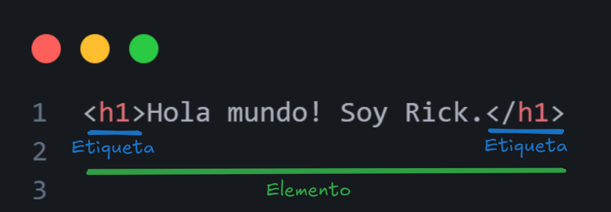
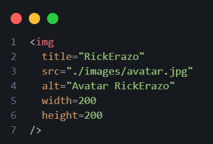

# HTML 
### HyperText Markup Language

Permite describir la estructura de los archivos web.

> **NOTA:** se utiliza _"index.html"_ debido a que en la antigüedad por defecto, todas las páginas de la web buscaban el archivo de entrada index.

### Etiquetas y Elementos



#### Tipos de etiquetas

##### Títulos
```
<h1>Título 1</h1>
<h2>Título 2</h2>
<h3>Título 3</h3>
<h4>Título 4</h4>
<h5>Título 5</h5>
<h6>Título 6</h6>
```

##### Párrafos
```
<p>Párrafo</p>
```

#### Etiquetas anidadas
```
<p>
Párrafo
<strong>negrita</strong>
</p>
```

##### Listas desordenadas
```
<ul>
  <li>Elemento de lista</li>
  <li>Elemento de lista</li>
  <li>Elemento de lista</li>
</ul>
```

##### Listas ordenadas
```
<ol>
  <li>Elemento de lista</li>
  <li>Elemento de lista</li>
  <li>Elemento de lista</li>
</ol>
```

#### Etiquetas reemplazables

Estos elementos son reemplazados por un tipo de contenido en específico, en el siguiente caso, multimedia.
```

```

Otro tipo es ```<input >```

### Atributos
Proporcionan información adicional a los elementos HTML. Existen dos tipos de atributos:
- **Globales:** se pueden utilizar en cualquier etiqueta HTML. Por ejemplo: _class, id, style, role, etc._
  * _**id:**_ es un atributo el cual identifica al elemento HTML como único dentro del proyecto, motivo por el cual debe ser exclusivo y no repetirse.
  * _**class:**_ es la identificación que se le puede dar a uno o varios elementos que posean el mismo comportamiento o se repitan.
- **Específicos:** ayuda a identificar al tipo de la etiqueta necesaria. Por ejemplo: _src, alt, etc._



> **NOTA:** se recomienda utilizar en las etiquetas letras minúsculas siempre.

HTML no requiere los estilos.

> **NOTA:** la representación de los elementos en HTML se da debido a los _user agent stylesheet_ que tienen por defecto cada navegador.

### Estructura básica de HTML

Para un documento HTML se utiliza la siguiente etiqueta:
```
<!DOCTYPE html>
```
Ayuda a especificar que tipo de documento se está leyendo en el navegador.

Las estructura básica de un documento HTML es el siguiente:
```
<!DOCTYPE html>
<html>
  <head>
  </head>
  <body>
  </body>
</html>
```

En el cual, en la etiqueta de ```<head>``` se especifican metadatos, información extra, links, los cuales no se van a renderizar en la red. Mientras que el ```<body>``` se especifica el contenido visible de la página web.

### HTML semántico

Existen 2 etiquetas no semánticas en HTML que sirven simplemente para agrupar, ya sea en línea (```<span>```) en bloque (```<div>```) el contenido.

> **NOTA:** NO TODO SE DEBE UBICAR EN UN ```<div>```


```<h1><h2><h3><h4>```: Son encabezados de diferentes niveles. Se utilizan para jerarquizar y organizar el contenido en títulos y subtítulos.

```<p>```: Se utilizan para definir párrafos de texto. Es usado para contenido textual común y no como título.

```<strong>```: Resalta el texto en negrita y le da énfasis semántico.

```<main>```: Define la parte principal del contenido de la página, solo debe ser usado una vez. No debe tener elementos repetitivos (como menús o barras laterales). Representa el núcleo del contenido y no una simple agrupación de elementos. 

```<a>```: Sirve para enlazar a otras páginas, archivos, correos electrónicos o secciones dentro de la misma página, se usa para NAVEGACIÓN.
Atributos importantes:
- href: Define la URL a la que apunta el enlace.
target="_blank": Abre el enlace en una pestaña nueva.
rel="noopener noreferrer": Aumenta la seguridad si el enlace abre una nueva pestaña.

```<nav>```: Se usa para contener enlaces de navegación, como menús o barras de navegación. Está diseñado exclusivamente para NAVEGACIÓN.

```<aside>```: Se usa para información complementaria. Se usa para contenido menos relevante o relacionado.

```<section>```: Agrupa contenido relacionado en bloques temáticos. Tiene significado semántico.

```<header>```: Se usa para agrupar encabezados dentro de una sección o página. A diferencia de los ```<h1>-<h6>```, agrupa estos encabezados con otro contenido relevante.

```<article>```: Se usa para contenido independiente (como noticias o posts), se diferencia de ```<section>``` porque puede existir de forma independiente.

```<footer>```: Define un pie de página para una sección o la página completa. Es específico para información como créditos,e nlaces de contacto, etc.

### Formularios

Se utiliza la etiqueta ```<form>``` con dos atributos importantes:
* method: se usa para especificar cómo se enviarán los datos del formulario al servidor. Pueden ser GET o POST.
* action: especifica la URL a la que se enviarán los datos del formulario cuando el usuario haga clic en el botón de enviar.

Dentro de los formularios existen etiquetas específicas tales como:

```<fieldset>```: Agrupa visualmente y semánticamente elementos dentro de un formulario. Se usa para organizar mejor los campos relacionados.
```<legend>```: Define un título para un ```<fieldset>```, proporcionando contexto sobre los elementos dentro del grupo.
```<label>```: Asocia un texto descriptivo con un campo de entrada (```<input>```, ```<textarea>```, ```<select>```)
```<input>```: Define un campo de entrada en el formulario. Tiene múltiples tipos:
* text
* password
* email
* chechbox
* radio   

```<button>```: es más flexible que input submit dado que permite contenido HTML dentro del butón.
> **NOTA:** todo botón implementado dentro de un formulario ```<form>``` es de tipo submit.

```<datalist>```: se utiliza para crear una lista de opciones predefinidas para un campo input. Permite mostrar sugerencias al usuario a medida que escribe, sin limitarlo solo a esas opciones.

```<details>```: se utiliza para crear un bloque desplegable que el usuario puede expandir o contraer.

### Etiquetas especiales
#### video
Insertar videos
```
<video controls width="320">
  <source src="video.mp4" type="video/mp4">
  Tu navegador no soporta el video.
</video>
```
#### audio
Insertar audios
```
<audio controls>
  <source src="audio.mp3" type="audio/mpeg">
  Tu navegador no soporta el audio.
</audio>
```
#### iframe
Insertar otra página web
```
<iframe src="https://www.example.com" width="400" height="300"></iframe>
```
#### dialog
Sirve para crear cuadros de diálogo modales o emergentes en una página web, como ventanas de confirmación, formularios emergentes, mensajes, etc.